# springboot-libraryManageSystem

>  藉籍图书管理系统 ，使用当前最为流行的 SpringBoot 框架，可作为springboot的入门项目练习使用，也可稍加改进做一个毕业设计项目。 

##  一、相关技术栈

1. **前端：** Thymeleaf、Layui、Ajax、JQuery
2. **后端** ： springboot , mybatis 
3. **开发环境：** IDEA 、SpringBoot 2.3、Maven
4. **数据库**：MySQL 5.7

### 默认用户

当您运行初始脚本后，默认存在以下用户，便于测试：

| 登录名 | 密码   | 用户角色 |
| :---- | :----- | :------ |
| user1  | 123456 | 普通用户 |
| user2  | 123456 | 普通用户 |
| admin  | 123456 |  管理员  |

## 二、主要功能


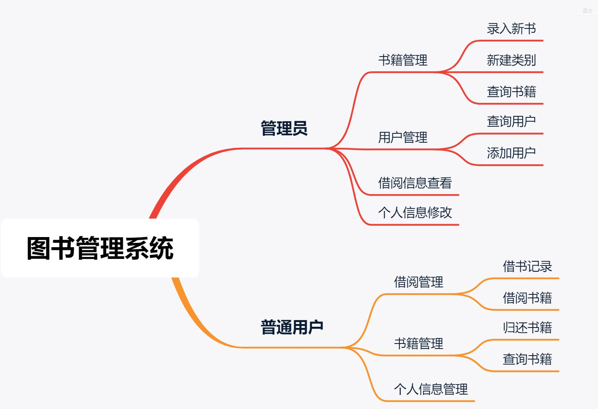

## 三、数据库表结构设计  

## 四 、界面设计

### ①、登录界面

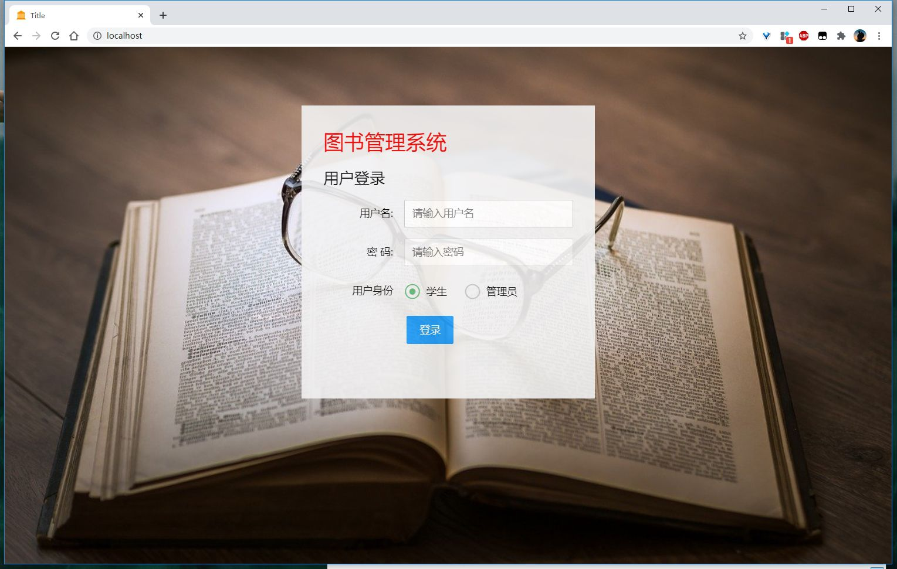

### ②、管理员界面

管理员首页

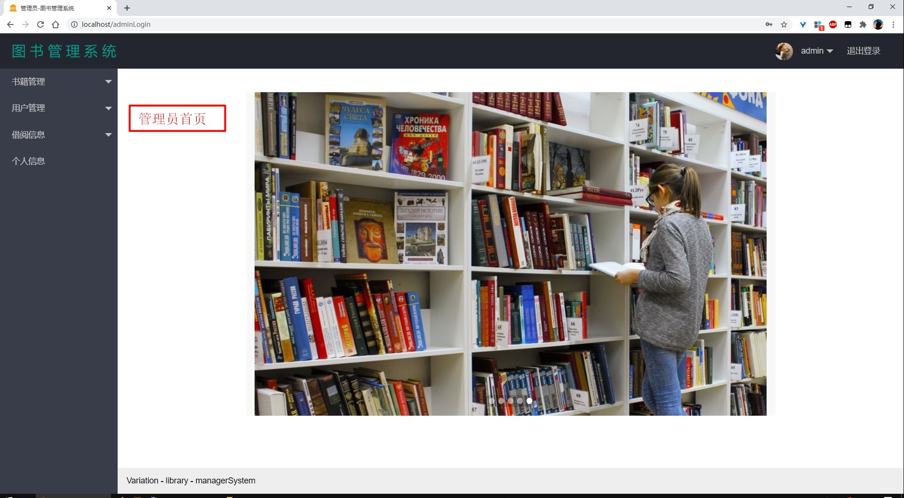

添加书籍

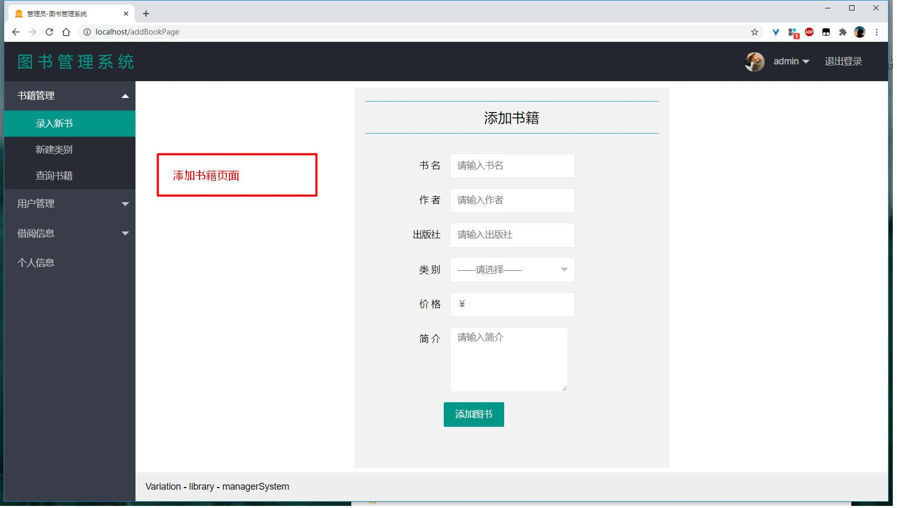

新建书籍类别

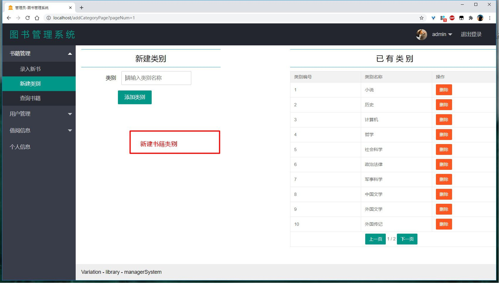

查询书籍

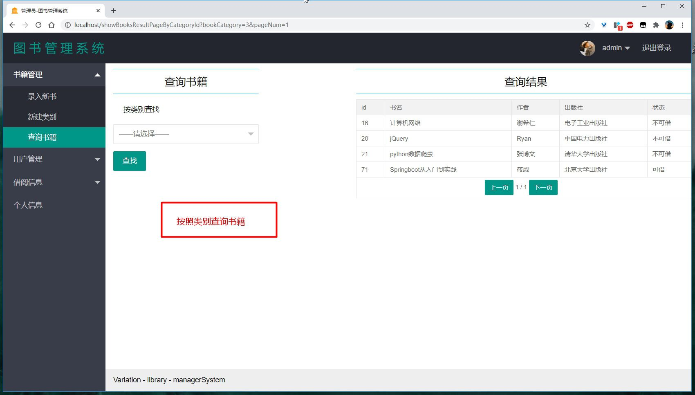


用户管理

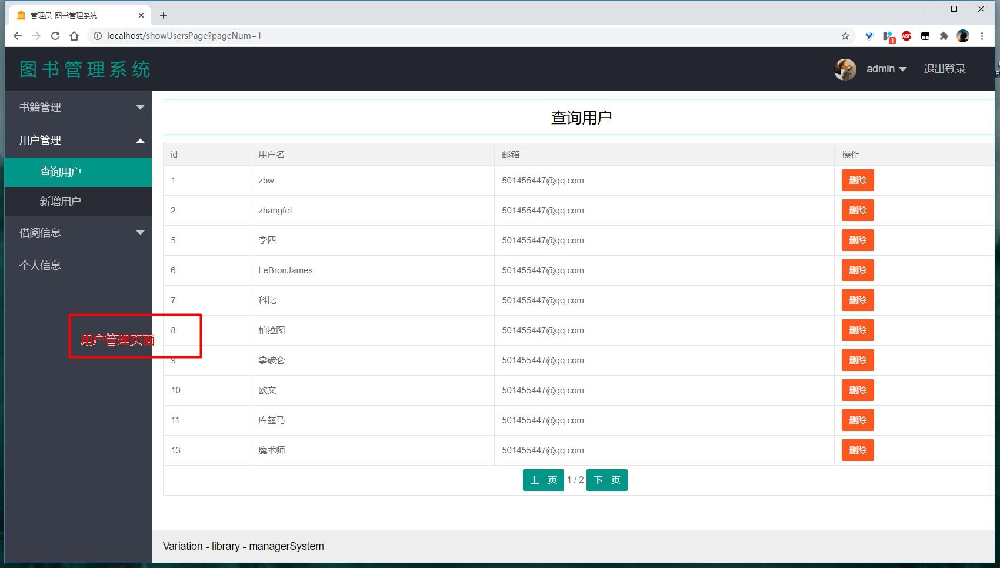

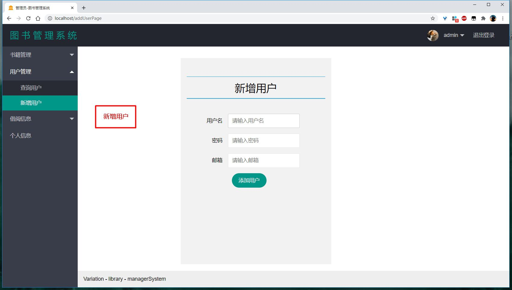


借阅信息

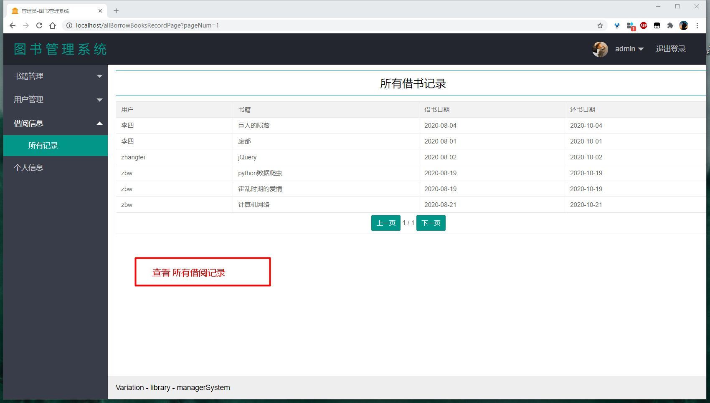

管理员信息修改

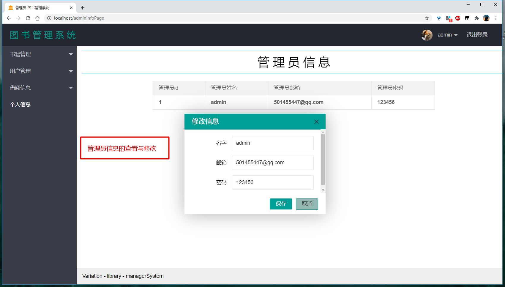


### ③、用户运行界面  

用户登录首页

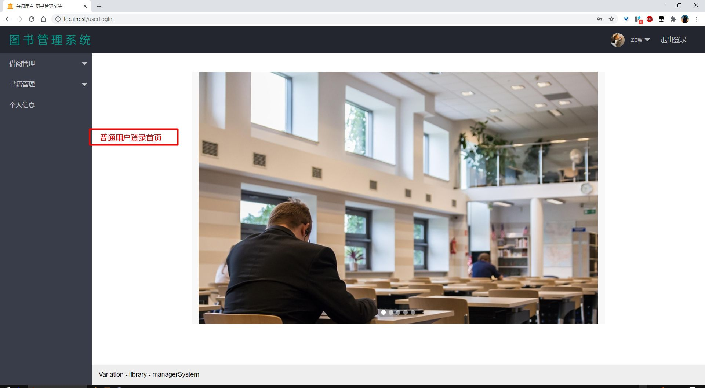

用户借书记录

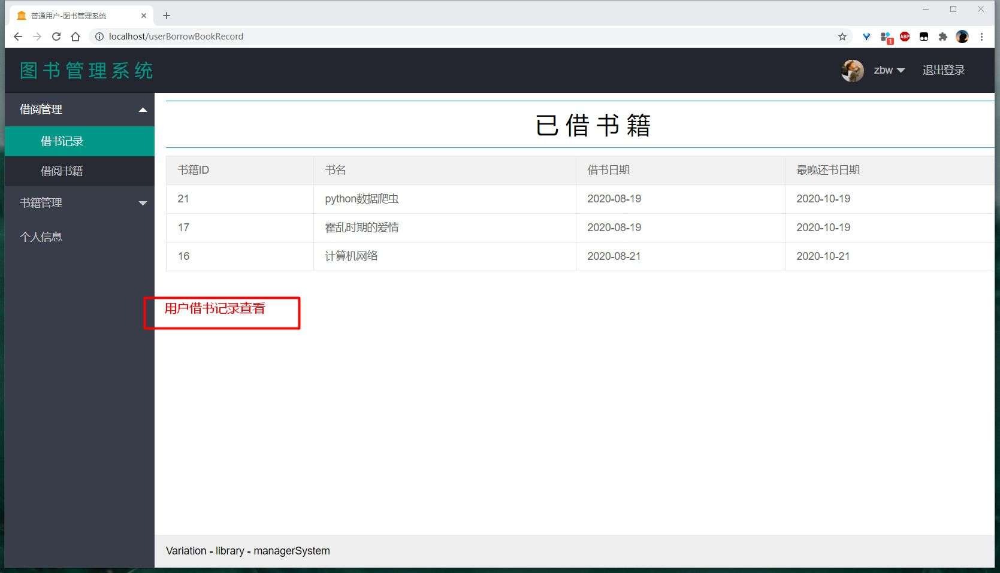


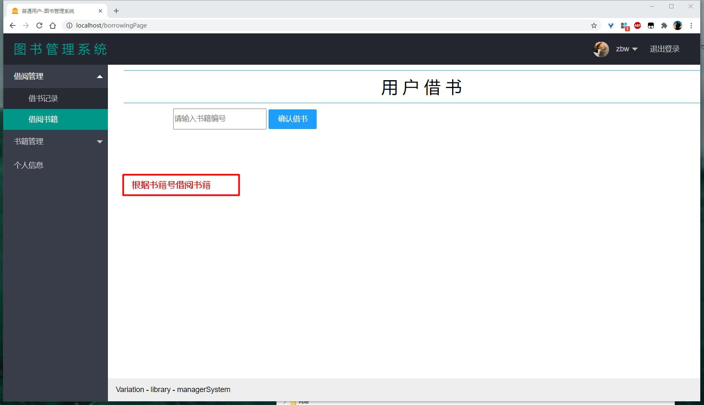

## 五、项目部署启动

### ①、部署环境准备

- jdk1.8
- mysql 5.7+
- maven

### ②、具体部署

#### 数据库配置【必须】

1. 本地安装 MySQL 环境，所需版本为 `5.7+`

2. 创建数据库名为 `library-manager-system`，数据库编码采用 `utf8mb4`，排序规则为 `utf8mb4_general_ci`

    ```
    CREATE DATABASE IF NOT EXISTS library-manager-system default charset utf8mb4 COLLATE utf8mb4_general_ci;
    ```

3. 导入项目中 `/src/main/resources/db/library-manager-system.sql` 到 `express`库。

     **使用 source 命令**  【也可通过图形化软件进行导入(如Navicat)】

    ```powershell
    use library-manager-system; # 选择数据库
    source /your/path/library-manager-system.sql; # Source 导入
    ```
	
4. 编辑 `application-dev.yaml` 文件，修改数据库连接信息。

   ```yaml
   datasource:
       driver-class-name: com.mysql.cj.jdbc.Driver # MySQL驱动，无需修改
       # 数据库连接URL，以下为连接本地的 library-manager-system 库的 url 示例
       url: jdbc:mysql://localhost:3306/library-manager-system?useUnicode=true&serverTimezone=UTC&characterEncoding=utf-8&useSSL=false
       username: root # 数据库连接名
       password: 123456 # 数据库连接密码
   ```